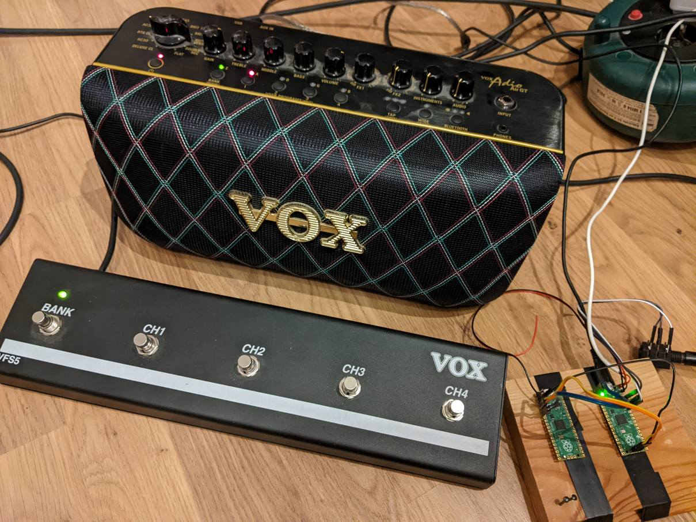

# vox_vfs5_adio_switch
Use raspberry pico to drive an Vox Adio Air GT via Vox VFS5 footswitch using MIDI-USB

# Caution
Use at your own risk. This is a proof-of-concept, I do not take any responsibility for any damage this project can cause.  

# Getting Started

Use [https://github.com/rppicomidi/midi2usbhost](URL) as a starting point, you need this to get the TinyUSB midi host support (not yet part of the pico sdk). Follow the software and hardware setup guide, you can skip the MIDI UART part, we only need the tinyusb midi host.

Important: for USB host mode you need to use an external power source connected via VBUS (not VSYS).

The VOX VFS5 footswitch is connected via a 6.3mm stereo jack, wired to GP28/ADC2: 

  * tip   => pin36: +3.3V power to 3V3(OUT)
  * ring  => pin34: analog input ADC2 (GP28)
  * shaft => pin33: ground AGND 

# Software
Download `vox_vfs5_adio_switch.uf2`firmware to the pico, on init the LED will blink one time. Connect the Vox Adio via an USB cable (USB 2.0 type-B to micro USB, not very common, either get an adapter or wire something).

The LED will show the connected status of the MIDI device.

Use VFS5 for user program selection as on the Adio (Bank A/B, Channel 1-4). 

